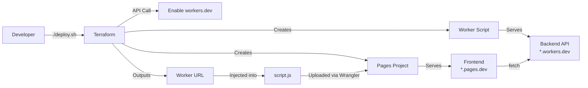

# ☁️ Cloudflare Full-Stack Deployment with Terraform

> **Infrastructure-as-Code deployment of a full-stack application on Cloudflare's edge network — Workers (Backend) + Pages (Frontend), fully automated with modular Terraform and a single deploy script.**

---

## 📋 Table of Contents

- [Architecture](#-architecture)
- [Tech Stack](#-tech-stack)
- [Project Structure](#-project-structure)
- [Prerequisites](#-prerequisites)
- [Getting Started](#-getting-started)
- [One-Command Deployment](#-one-command-deployment)
- [What the Deploy Script Does](#-what-the-deploy-script-does)
- [Terraform Modules](#-terraform-modules)
- [How It Works End-to-End](#-how-it-works-end-to-end)
- [Common Operations](#-common-operations)
- [Security Notes](#-security-notes)

---

## 🏗 Architecture

```
                    ┌─────────────────────────────────────────────────────┐
                    │                  Cloudflare Edge                   │
                    │                                                     │
┌──────────┐       │   ┌──────────────────┐     ┌──────────────────┐    │
│          │  HTTPS │   │  Pages (Frontend) │     │ Workers (Backend) │    │
│  Browser │──────────► │  *.pages.dev     │────►│ *.workers.dev     │    │
│          │       │   │  Static HTML/CSS  │     │  REST API         │    │
└──────────┘       │   └──────────────────┘     └──────────────────┘    │
                    │                                                     │
                    └─────────────────────────────────────────────────────┘
                                         │
                                         │ Managed by
                                         ▼
                                ┌──────────────────┐
                                │    Terraform      │
                                │  (IaC - Modular)  │
                                └──────────────────┘
```

| Layer          | Service             | Description                                      | URL                                     |
|----------------|---------------------|--------------------------------------------------|------------------------------------------|
| **Frontend**   | Cloudflare Pages    | Static site (`index.html`, `style.css`, `script.js`) | `https://mahesh-frontend.pages.dev`     |
| **Backend**    | Cloudflare Workers  | Serverless API (`worker-src/index.js`)           | `https://mahesh-backend-worker.maheshbhoopathi.workers.dev` |
| **Infra**      | Terraform           | Provisions and manages all Cloudflare resources  | —                                        |

---

## � Tech Stack

| Tool             | Purpose                                  |
|------------------|------------------------------------------|
| **Terraform**    | Infrastructure as Code — provisions Workers + Pages |
| **Cloudflare Workers** | Serverless backend (V8 isolates at the edge) |
| **Cloudflare Pages**   | Static frontend hosting with global CDN  |
| **Wrangler CLI** | Deploys frontend assets to Pages         |
| **Bash**         | Automation deploy script                 |

---

## 📁 Project Structure

```
cloudfare/
├── index.html                          # Frontend — HTML
├── style.css                           # Frontend — Styles
├── script.js                           # Frontend — JS (calls backend)
├── deploy.sh                           # 🚀 One-command deploy script
│
└── terraform/
    ├── providers.tf                    # Cloudflare provider config (v4)
    ├── variables.tf                    # Root input variables
    ├── main.tf                         # Root module — wires workers + pages
    ├── outputs.tf                      # Deployment URLs & summary
    ├── terraform.tfvars.example        # Template for credentials
    │
    ├── worker-src/
    │   └── index.js                    # Worker source code (backend API)
    │
    └── modules/
        ├── workers/                    # Worker module
        │   ├── main.tf                 #   → cloudflare_workers_script
        │   ├── variables.tf            #   → module inputs
        │   └── outputs.tf              #   → worker_name, worker_url
        │
        └── pages/                      # Pages module
            ├── main.tf                 #   → cloudflare_pages_project
            ├── variables.tf            #   → module inputs
            └── outputs.tf              #   → pages_url, pages_subdomain
```

---

## ✅ Prerequisites

| Requirement       | Version   | Install                                              |
|-------------------|-----------|------------------------------------------------------|
| Terraform         | ≥ 1.5.0   | [terraform.io/install](https://developer.hashicorp.com/terraform/install) |
| Node.js + npm     | ≥ 18      | [nodejs.org](https://nodejs.org)                     |
| Cloudflare Account | —        | [dash.cloudflare.com](https://dash.cloudflare.com)   |

**Cloudflare API Token** — Create one with these permissions:
- `Workers Scripts: Edit`
- `Cloudflare Pages: Edit`
- `Account Settings: Read`

---

## 🚀 Getting Started

### 1. Clone the repository

```bash
git clone https://github.com/your-username/cloudfare.git
cd cloudfare
```

### 2. Configure credentials

```bash
cp terraform/terraform.tfvars.example terraform/terraform.tfvars
```

Edit `terraform/terraform.tfvars`:

```hcl
# REQUIRED
cloudflare_api_token  = "your-api-token"
cloudflare_account_id = "your-account-id"
workers_subdomain     = "your-subdomain"     # Found in dashboard → Workers & Pages
```

> **💡 Where to find these values:**
> - **API Token** → Cloudflare Dashboard → My Profile → API Tokens → Create Token
> - **Account ID** → Dashboard → Overview → right sidebar
> - **Workers Subdomain** → Dashboard → Workers & Pages → your subdomain (e.g. `maheshbhoopathi`)

### 3. Deploy

```bash
./deploy.sh
```

That's it! Both backend and frontend will be live.

---

## ⚡ One-Command Deployment

```bash
./deploy.sh
```

The script automates the **entire pipeline** — no manual steps required:

```
 ▶ Initializing Terraform...
 ✔ Terraform initialized
 ▶ Validating Terraform configuration...
 ✔ Configuration valid
 ▶ Planning infrastructure changes...
 ✔ Plan complete
 ▶ Applying infrastructure (Worker + Pages project)...
 ✔ Infrastructure deployed
 ▶ Preparing frontend build...
 ✔ Frontend build ready (Worker URL injected)
 ▶ Deploying frontend assets to Cloudflare Pages...
 ✔ Frontend deployed to Pages

 ╔══════════════════════════════════════════════╗
 ║         🚀 Deployment Complete!              ║
 ╠══════════════════════════════════════════════╣
 ║  Backend:  https://mahesh-backend-worker.maheshbhoopathi.workers.dev
 ║  Frontend: https://mahesh-frontend.pages.dev
 ╚══════════════════════════════════════════════╝
```

---

## 🔧 What the Deploy Script Does

The `deploy.sh` script runs **7 automated steps**:

| Step | Action                        | Tool       | What Happens                                                  |
|------|-------------------------------|------------|---------------------------------------------------------------|
| 1    | **Initialize**                | Terraform  | Downloads Cloudflare provider, initializes modules            |
| 2    | **Validate**                  | Terraform  | Checks all `.tf` files for syntax/config errors               |
| 3    | **Plan**                      | Terraform  | Previews resources to be created/updated                      |
| 4    | **Apply**                     | Terraform  | Deploys Worker script + creates Pages project + enables workers.dev |
| 5    | **Build**                     | Bash       | Copies frontend files to `_build/`, injects Worker URL into `script.js` |
| 6    | **Deploy Frontend**           | Wrangler   | Uploads `_build/` to Cloudflare Pages                         |
| 7    | **Cleanup**                   | Bash       | Removes `_build/` temp directory                              |

> **Why a `_build` directory?** Deploying directly from the project root would upload the `terraform/.terraform/` folder (45+ MB provider binaries), which exceeds Cloudflare Pages' 25 MB file size limit. The build step copies only the 3 frontend files.

---

## 🧩 Terraform Modules

### `modules/workers` — Backend API

Deploys a Cloudflare Worker script and automatically enables the `*.workers.dev` subdomain.

| Variable            | Required | Default        | Description                        |
|---------------------|----------|----------------|------------------------------------|
| `account_id`        | ✅       | —              | Cloudflare Account ID              |
| `api_token`         | ✅       | —              | API token (for enabling workers.dev) |
| `worker_name`       | ✅       | —              | Worker script name                 |
| `script_content`    | ✅       | —              | JavaScript source code             |
| `workers_subdomain` | ✅       | —              | Your workers.dev subdomain         |
| `environment`       | ❌       | `"production"` | Environment label                  |
| `zone_id`           | ❌       | `""`           | Zone ID for custom domain routing  |
| `route_pattern`     | ❌       | `""`           | Route pattern (e.g. `api.x.com/*`) |

**Resources created:**
- `cloudflare_workers_script` — The worker itself
- `cloudflare_workers_route` — Custom domain route (optional)
- `terraform_data` — Enables `*.workers.dev` via Cloudflare API

**Outputs:** `worker_name`, `worker_url`

---

### `modules/pages` — Frontend

Creates a Cloudflare Pages project with environment variables configured via `deployment_configs`.

| Variable               | Required | Default        | Description                       |
|------------------------|----------|----------------|-----------------------------------|
| `account_id`           | ✅       | —              | Cloudflare Account ID             |
| `project_name`         | ✅       | —              | Pages project name                |
| `production_branch`    | ❌       | `"main"`       | Git branch for production         |
| `compatibility_date`   | ❌       | `"2026-03-01"` | Workers compatibility date        |
| `worker_url`           | ❌       | `""`           | Backend URL (injected as env var) |
| `environment_variables`| ❌       | `{}`           | Additional environment variables  |

**Resources created:**
- `cloudflare_pages_project` — Pages project with `deployment_configs`

**Outputs:** `pages_project_name`, `pages_url`, `pages_subdomain`

---

## 🔄 How It Works End-to-End



**Data Flow:**
1. User visits `https://mahesh-frontend.pages.dev`
2. Browser loads `index.html`, `style.css`, `script.js` from Pages CDN
3. User clicks "Call Backend" → `script.js` calls the Worker URL
4. Worker at `https://mahesh-backend-worker.maheshbhoopathi.workers.dev` processes the request
5. Response is displayed in the frontend

---

## 🔄 Common Operations

### Destroy all resources
```bash
cd terraform && terraform destroy
```

### Update Worker code only
Edit `terraform/worker-src/index.js`, then:
```bash
./deploy.sh
# Or target just the worker:
cd terraform && terraform apply -target=module.workers
```

### Update frontend only
Edit `index.html` / `style.css` / `script.js`, then:
```bash
npx wrangler pages deploy ./_build --project-name=mahesh-frontend --branch=main
```

### View current outputs
```bash
cd terraform && terraform output
```

---

## 🔒 Security Notes

| Item | Status | Notes |
|------|--------|-------|
| API Token in `terraform.tfvars` | ✅ Gitignored | Never commit to version control |
| `terraform.tfstate` | ✅ Gitignored | Contains sensitive data |
| `.terraform/` | ✅ Gitignored | Provider binaries |
| CORS Headers | ⚠️ Permissive | Currently `Access-Control-Allow-Origin: *` — restrict in production |
---


